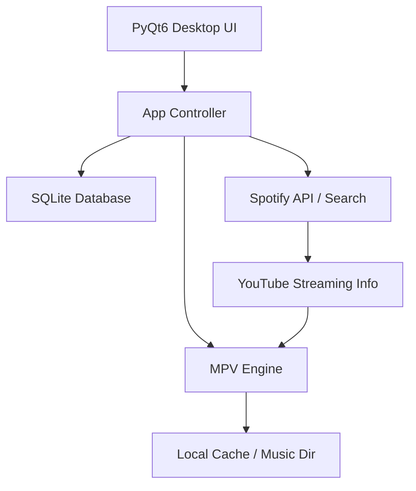

# 🎧 Personal Spotify Desktop Wrapper

A full-featured, high-performance desktop music application built with **PyQt6** and **MPV**. This app combines Spotify's superior metadata and recommendation engine with YouTube's vast audio library for unlimited, high-quality streaming and offline playback.

 *(Mockup Preview)*

---

## 🚀 Features

### 🎵 Playback & Discovery
- **Full Song Streaming**: Search any track on Spotify and stream the best available audio from YouTube.
- **Smart Recommendations**: Custom "Daily Mix" generated from your liked songs and listening history.
- **Advanced Metadata**: Rich artist pages, album art, and track details via Spotify API.
- **Queue System**: Add songs to your queue and manage playback order.

### ❤️ Library & Personalization
- **Liked Songs**: One-click to save your favorite tracks.
- **Recently Played**: Seamlessly pick up where you left off.
- **Playlists**: Create and manage your own custom music collections.

### 📥 Downloads & Offline Mode
- **Auto-Cache**: Streamed songs are automatically cached for smoother repeat playback.
- **Permanent Downloads**: Save entire playlists or single songs for 100% offline use.
- **High Quality**: Audio extracted at the best possible bitrate using `yt-dlp`.

---

## 🛠️ Architecture



---

## ⚙️ Installation & Setup

### 1. Requirements
- **Python**: 3.9+ 
- **FFmpeg**: Required by `yt-dlp` for high-quality audio extraction.
- **libmpv**: The core audio engine.

### 2. Install Dependencies
```bash
pip install -r requirements.txt
```

### 3. Setup Spotify API Credentials
To enable metadata search and recommendations, you'll need your own Spotify Client ID and Client Secret from the [Spotify Developer Dashboard](https://developer.spotify.com/dashboard).

**Set your credentials as environment variables:**
```powershell
# Windows PowerShell
$env:SPOTIPY_CLIENT_ID='your_client_id'
$env:SPOTIPY_CLIENT_SECRET='your_client_secret'
```

### 4. Setup MPV (Windows)
Download `libmpv-2.dll` from [mpv.io](https://mpv.io/installation/) or Use `choco install mpv`. Ensure the DLL is in your system's PATH or copy it directly into the project root.

---

## 🚀 Running the Application

### Option 1: Windows (Recommended)
We've provided a PowerShell script that checks for Python, creates a virtual environment, installs dependencies, and launches the app automatically.

```powershell
./setup_windows.ps1
```

### Option 2: Manual Execution
If you've already installed the requirements and set up your Spotify credentials:

1. **Activate your virtual environment** (if using one):
   ```powershell
   # Windows
   .\venv\Scripts\activate
   ```
2. **Run the main script**:
   ```bash
   python main.py
   ```

---

## 📁 Project Structure
- **/ui**: PyQt6 interface components (Sidebar, Home, Search, Player).
- **/core**: Business logic and engine controllers.
- **/Music**: Permanent offline storage.
- **/Cache**: Temporary stream storage.
- **main.py**: Entry point.

---

## 📄 License
This project is for personal use only. Please respect the copyright of the music and the terms of service of the third-party platforms used.
